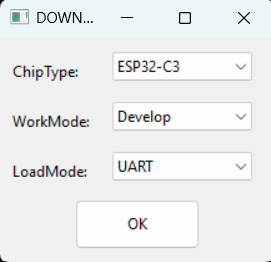
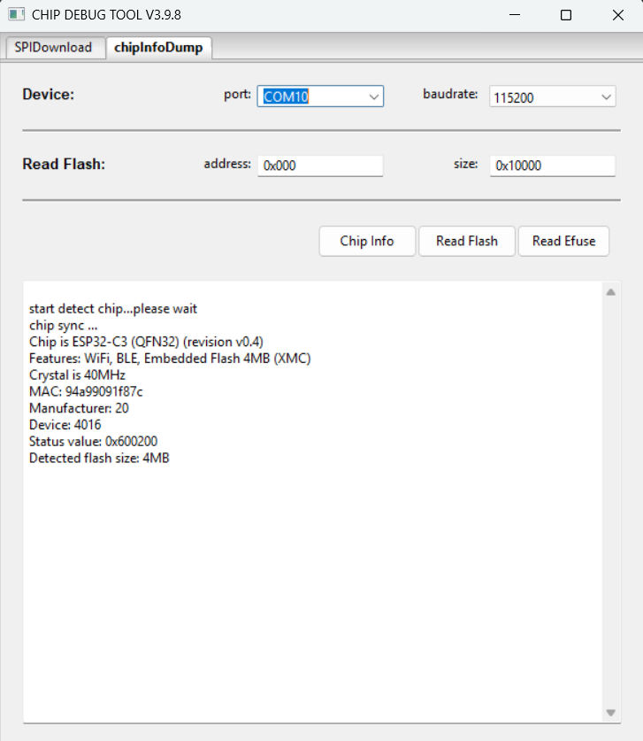
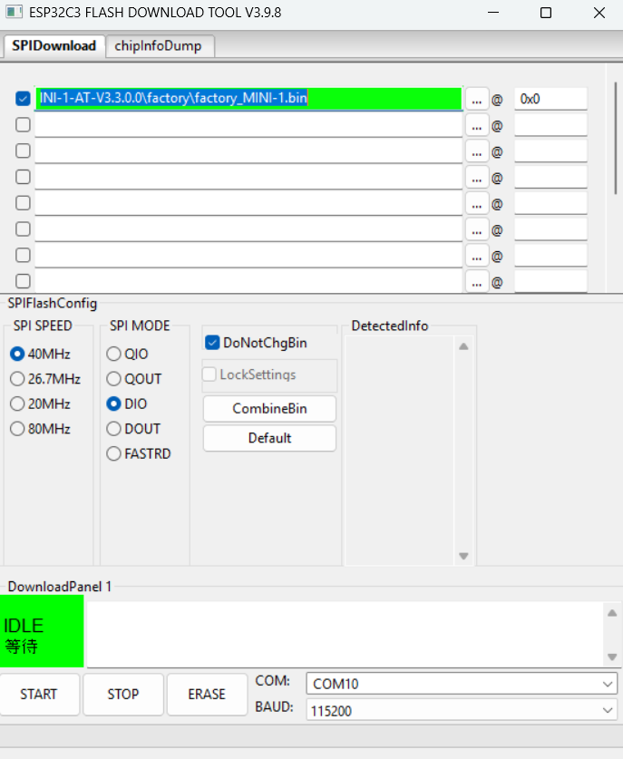
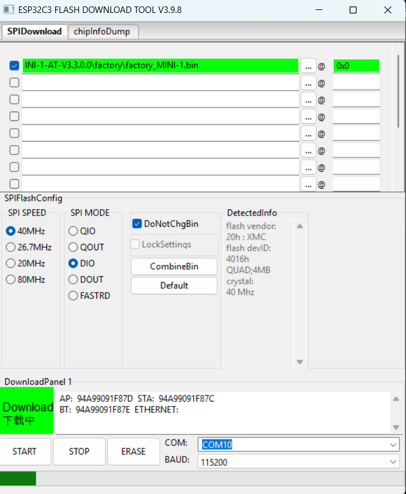
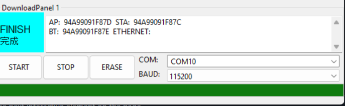

# VSD32-S3 — Flashing AT Firmware over UART

This short guide shows you how to download the **AT firmware** image and flash it onto a **VSD32-S3** board (ESP32-C3 Wi-Fi/BLE module) using Espressif’s *Flash Download Tool*.

> **Before you start**  
> Make sure the hardware is wired exactly as shown in the table below.

| VSD32-S3 signal / pin | Connect to           | Notes                                                  |
|-----------------------|----------------------|--------------------------------------------------------|
| **WiFi_P_Tx**         | FTDI232 **Rx**       | UART TX from VSD32-S3 → FTDI RX                        |
| **WiFi_P_Rx**         | FTDI232 **Tx**       | UART RX on VSD32-S3 ← FTDI TX                          |
| **GND**               | FTDI232 **GND**      | Common ground reference                                |
| **WiFi_P_BOOT**       | VSD32-S3 **GND**     | Keep low to boot ESP32-C3 into normal flash-run mode   |

---

## 1. Download the required files

| File | Purpose | Link |
|------|---------|------|
| **factory_MINI-1.bin** | AT firmware image | <https://github.com/VSDSquadron/VSDSquadron_Ultra/blob/main/factory_MINI-1.bin> |
| **flash_download_tool.zip** | Espressif Flash Download Tool (Windows) | <https://github.com/VSDSquadron/VSDSquadron_Ultra/blob/main/flash_download_tool.zip> |

Unzip **flash_download_tool.zip** somewhere convenient (e.g. `C:\esp\flash_tool\`).

---

## 2. Flash the firmware

1. **Open** `flash_download_tool_x.x.x.exe`.  
2. In the first dialog choose the **ChipType** → `ESP32-C3`.  
3. Choose **WorkMode** → `Develop`.  
4. Choose **LoadMode** → `UART`. (see below image)
5. Click **OK** to enter the main window.  

   

---

### 3. Verify the connection with **Chip Debug Tool**

After you click **OK** in step&nbsp;5, a new window titled **CHIP DEBUG TOOL V3.9.8** pops up.

1. Click the **`chipInfoDump`** tab.
2. In the **port** drop-down, choose the COM port that the **VSD32-S3** is attached to  
   (if two ports appear, unplug the board to see which one disappears, then re-select it).
3. Leave **baudrate** at **115200**.
4. Press **Chip Info**.

If everything is wired correctly, the log area should show output similar to:



> **Troubleshooting:**  
> • If “chip sync …” never completes, swap **TX/RX** lines or re-check that **WiFi_P_BOOT** is firmly tied low.  
> • Make sure the COM port isn’t already open in another terminal session.

Continue with step 4 to select the firmware binary and start flashing.

---

### 4.  Load the firmware in **SPIDownload** tab and flash

1. Switch back to the **`SPIDownload`** tab.  
2. In the **first line** of the file table click **`…`** and browse to the firmware image you downloaded earlier:  
   `factory_MINI-1.bin`
3. **Address** → `0x0` (leave the default value).  
4. Tick the checkbox for that row so the file is enabled.  
5. Leave **DoNotChgBin** checked (keeps the factory-image SPI flash settings).  
6. Confirm the default SPI settings:  

   | Setting  | Value |
   |----------|-------|
   | **SPI SPEED** | 40 MHz |
   | **SPI MODE**  | DIO    |
   | **BAUD**      | 115 200 bps (or lower if you see sync errors) |
   | **COM**       | Port you selected in the previous step |

7. Click **START**.  
   The log will show “Connecting…”, then a progress bar; when finished you should see **“FINISH”** in green.



> **Hint:** If flashing stalls at “Sync…”, press RESET on the VSD32-S3 while keeping **WiFi_P_BOOT** low, then click **START** again.

### 5.  Monitor flashing progress

Click **START** and the tool immediately begins writing the image to flash:

* A green **Download** status panel lights up.  
* The red bar at the very bottom fills from left-to-right, indicating progress (see screenshot below).  



> **Do not disconnect power or the USB cable until the bar reaches 100 % and the status changes to “FINISH”.**

When completed you should see the below image at the bottom of FLASH DOWNLOAD TOOL:



### 9. Upload a quick Soft-AP test sketch from Arduino IDE

You can now unplug the FTDI232 adapter; only the USB-C cable between your PC and **VSD32-S3** is required.

1. **Open Arduino IDE** (v2.x recommended).  
2. Ensure the **ESP32 Arduino** core is installed, then select  
   **Board → ESP32C3 Dev Module** and the **Port** that appears when the board is plugged in.  
3. Grab the test sketch: [`vsd32s3_softap.ino`](https://github.com/VSDSquadron/VSDSquadron_Ultra/blob/main/code/wifi/vsd32s3_softap.ino).  
4. Open the sketch and click **Upload**.  
5. When the upload completes, open **Serial Monitor** at **115200 baud**.

#### What the sketch does

```cpp
// vsd32s3_softap.ino
// Bring up ESP32-C3 as a Wi-Fi Access Point
// SSID = "VSD32-S3"
// PASS = "vsd12345"
```
The sketch sends AT commands to the ESP32-C3 module to:
1. reset the chip
2. switch to Soft-AP mode on channel 1 (WPA2-PSK)
3. set SSID VSD32-S3 and password vsd12345
4. print the AP’s IP and MAC addresses
