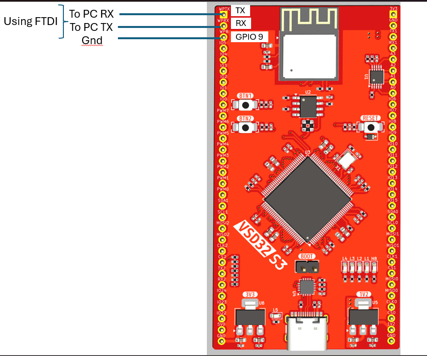
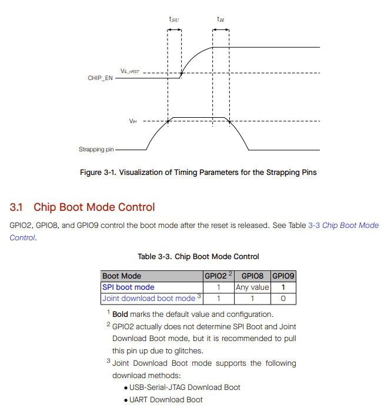

# VSD32-S3 — Flashing AT Firmware over UART

This short guide shows you how to download the **AT firmware** image and flash it onto a **VSD32-S3** board (ESP32-C3 Wi-Fi/BLE module) using Espressif’s *Flash Download Tool*.

> **Before you start**  
> Make sure the hardware is wired exactly as shown in the table below.

| VSD32-S3 signal / pin | Connect to           | Notes                                                  |
|-----------------------|----------------------|--------------------------------------------------------|
| **WiFi_P_Tx**         | FTDI232 **Rx**       | UART TX from VSD32-S3 → FTDI RX                        |
| **WiFi_P_Rx**         | FTDI232 **Tx**       | UART RX on VSD32-S3 ← FTDI TX                          |
| **GND**               | FTDI232 **GND**      | Common ground reference                                |
| **WiFi_P_BOOT**       | VSD32-S3 **GND**     | Keep low to boot ESP32-C3 into normal flash-run mode   |

---

## 1. Download the required files

| File | Purpose | Link |
|------|---------|------|
| **factory_MINI-1.bin** | AT firmware image | <https://github.com/VSDSquadron/VSDSquadron_Ultra/blob/main/factory_MINI-1.bin> |
| **flash_download_tool.zip** | Espressif Flash Download Tool (Windows) | <https://github.com/VSDSquadron/VSDSquadron_Ultra/blob/main/flash_download_tool.zip> |

Unzip **flash_download_tool.zip** somewhere convenient (e.g. `C:\esp\flash_tool\`).

---

## 2. Flash the firmware

1. **Open** `flash_download_tool_x.x.x.exe`.  
2. In the first dialog choose the **ChipType** → `ESP32-C3`.  
3. Choose **WorkMode** → `Develop`.  
4. Choose **LoadMode** → `UART`. (see below image)
   

6. Click **OK** to enter the main window.  
7. Browse for `factory_MINI-1.bin` and set the address to `0x0`.  
8. Select the correct COM port for your FTDI232 dongle and set baud (115 200 – 921 600 bps works; start with 460 800 for reliability).  
9. Press **Start** – flashing should complete in a few seconds.  
10. Power-cycle or reset the board; the AT command prompt should appear on the UART0 console.


---

## 3. Verifying the flash

Open a serial terminal (e.g. *PuTTY* or *minicom*) at the same baud rate you used for flashing and type:

```text
AT+GMR


# squadron_S3

Detailed steps : [Setup Guide](https://docs.espressif.com/projects/esp-at/en/latest/esp32c3/Get_Started/Downloading_guide.html)

## Overview
- download flash tool
- download AT firmware
- set strapping pins
- flash over UART0 after putting in UART BOOT MODE
- unset strapping pins
- reboot
- AT over UART 1 


[Hardware reference](https://docs.espressif.com/projects/esp-at/en/latest/esp32c3/Get_Started/Hardware_connection.html)

Based on above Hardware reference make the following connections






## Reference
[AT Commands](https://docs.espressif.com/projects/esp-at/en/latest/esp32c3/AT_Command_Set/index.html)
